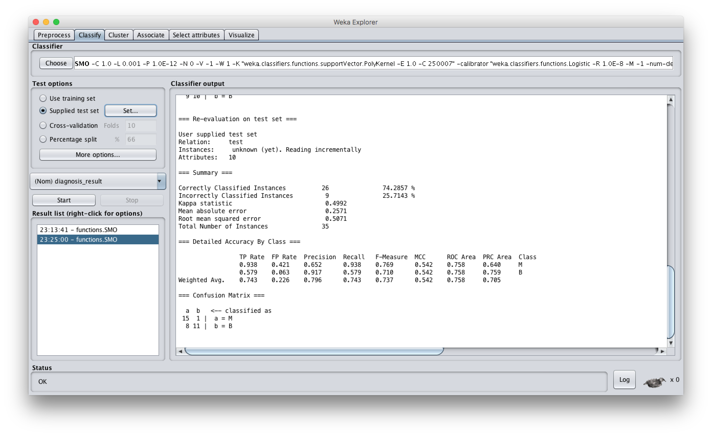

# Đồ án 2
## Phân lớp
```
MSSV: 14520945
Tên: Nguyễn Vĩnh Tiến
```

### 1. Mô tả dữ liệu:

Link dataset: [Prostate_Cancer](https://discuss.analyticsvidhya.com/uploads/analyticsvidhya/original/1X/e70a1105cd36e53cc13b6075aaa3175d36610d94.csv)

Dữ liệu về 100 bệnh nhân ung thư, mỗi bệnh nhân là 1 dòng dữ liệu. Gồm có các thuộc tính:

1. id : Số thứ tự (không quan tâm đến thuộc tính này do không có nhiều ý nghĩa)
1. diagnosis_result : Kết quả chẩn đoán (B = Lành tính, M = Ác tính)
2. radius 
3. texture 
4. perimeter 
5. area 
6. smoothness 
7. compactness 
8. symmetry 
9. fractal_dimension

Gồm có 1 thuộc tính phân lớp (diagnosis_result), ngoại trừ id, còn lại là các thuộc tính mang kiểu số, mang ý nghĩa về y học mô tả về khối u.

### 2. Dùng thuật toán k -  nearest neighbor trên R:

Load dữ liệu

```
> cancer <- read.csv("~/Downloads/Prostate_Cancer.csv")
> head(cancer)
  id diagnosis_result radius texture perimeter area smoothness compactness symmetry fractal_dimension
1  1                M     23      12       151  954      0.143       0.278    0.242             0.079
2  2                B      9      13       133 1326      0.143       0.079    0.181             0.057
3  3                M     21      27       130 1203      0.125       0.160    0.207             0.060
4  4                M     14      16        78  386      0.070       0.284    0.260             0.097
5  5                M      9      19       135 1297      0.141       0.133    0.181             0.059
6  6                B     25      25        83  477      0.128       0.170    0.209             0.076
```

Loại bỏ thuộc tính 1 và 2

```
> kInputCancer <- cancer[c(-1, -2)]
> head(kInputCancer)
  radius texture perimeter area smoothness compactness symmetry fractal_dimension
1     23      12       151  954      0.143       0.278    0.242             0.079
2      9      13       133 1326      0.143       0.079    0.181             0.057
3     21      27       130 1203      0.125       0.160    0.207             0.060
4     14      16        78  386      0.070       0.284    0.260             0.097
5      9      19       135 1297      0.141       0.133    0.181             0.059
6     25      25        83  477      0.128       0.170    0.209             0.076
```

Chia Làm 2 bộ: bộ train và bộ test theo tỉ lệ 65:35

```
> cancerTrain <- kInputCancer[1:65,]
> cancerTest <- kInputCancer[66:100,] 
```


Lấy 65 dòng đầu của cột diagnosis_result làm đầu vào của thuật toán và 35 dòng cuối để so sánh với kết quả của thuật toán

```
> library("class")
> kMeanResult <- knn(train = cancerTrain, test = cancerTest, cl = labelTrain, k = 10)
> kMeanResult
 [1] M B B B M M B M M B M M M M M B M M M M M M M B M M M M M M M B B B M
Levels: B M
```

Import thư viện và chạy thuật toán ta được kết quả. ( với số k = 10 )

```
> compare <- kMeanResult == labelTest
> table(compare)
compare
FALSE  TRUE 
    9    26 
```

So sánh với kết quả ta thấy khớp 26 dòng trên 35 dòng. Vậy độ chính xác của thuật toán trên bộ dữ liệu này là 74,28%.

```
> kMeanResult <- knn(train = cancerTrain, test = cancerTest, cl = labelTrain, k = 15)
> compare <- kMeanResult == labelTest
> table(compare)
compare
FALSE  TRUE 
    8    27 
```

Tăng số k lên, độ chính xác tăng lên.

```
> kMeanResult <- knn(train = cancerTrain, test = cancerTest, cl = labelTrain, k = 20)
> compare <- kMeanResult == labelTest
> table(compare)
compare
FALSE  TRUE 
   11    24 
```
Tăng k lên tiếp thì độ chính xác lại giảm. Vì khi xét quá nhiều điểm k sẽ xuất hiện những điểm dữ liệu nhiễu gây ảnh hưởng đến kết quả thuật toán.

### 3. Dùng Weka chạy thuật toán SVM
Mở file train.csv có 65% dữ liệu để trainning


Mở qua tab classify.Chọn function là SMO, cross-validation dùng số k-fold là 10. Ta chạy trainning dữ liệu.

Được độ chính xác 83,0769%. Sau đó chọn supplied test set



Độ chính xác của thuật toán trên bộ dữ liệu này là 74,2857%
